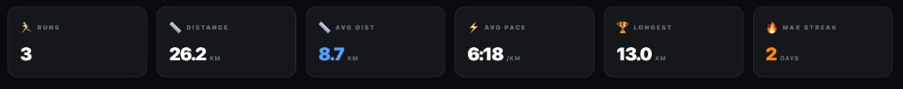
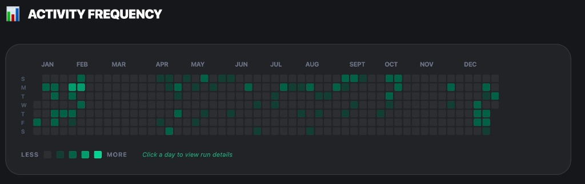
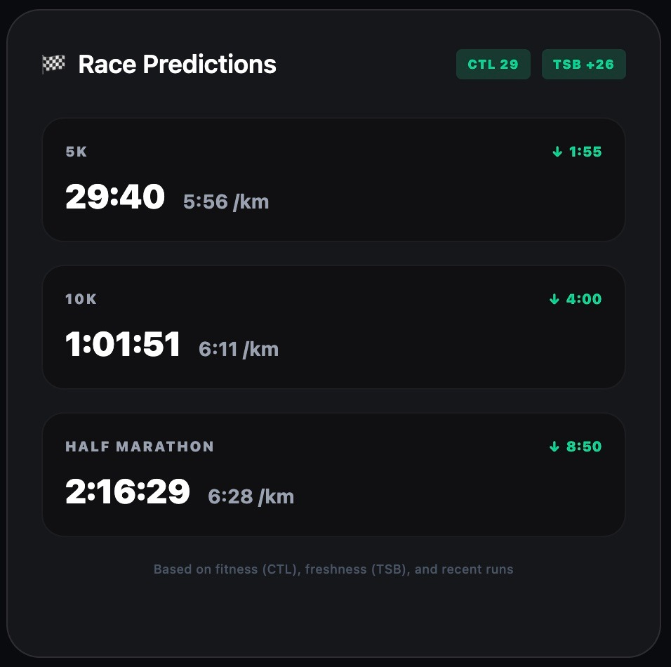
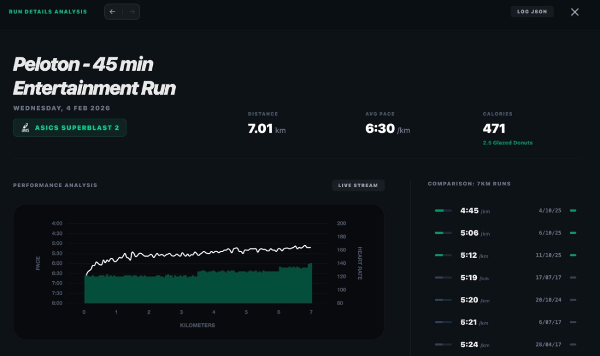
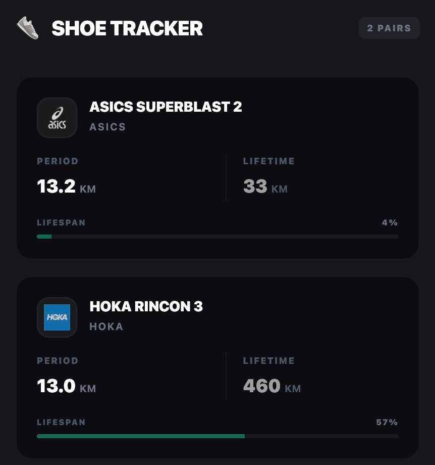

# RunViz 🏃‍♂️

A beautiful, mobile-friendly running stats dashboard that visualizes your Strava data with elite analytics.



## 📸 Screenshots

| Activity Frequency | Race Predictions |
|:---:|:---:|
|  |  |

| Run Analysis | Shoe Tracker |
|:---:|:---:|
|  |  |

## ✨ Features

### Advanced Analytics
- **Grade Adjusted Pace (GAP)** - See your equivalent flat-ground pace
- **Heart Rate Zone Analysis** - Time in each zone with custom thresholds
- **Training Load** - CTL/ATL/TSB fitness, fatigue, and form tracking
- **Pace Zone Distribution** - Visual breakdown of your effort

### Beautiful Visualizations
- 📅 **Calendar Heatmap** - GitHub-style activity visualization
- 📊 **Fitness/Freshness Chart** - Track your training over time
- 🏆 **PR Progress** - Personal record tracking
- 📱 **Mobile-First Design** - Looks great on any device

## 🚀 Quick Start (For Your Own Copy)

### Prerequisites
- Node.js 18+
- Cloudflare account (free tier works!)
- Strava account

### 1. Fork & Clone

```bash
git clone https://github.com/YOUR_USERNAME/runviz.git
cd runviz
```

### 2. Create Strava API Application

1. Go to [Strava API Settings](https://www.strava.com/settings/api)
2. Create a new application
3. Set **Authorization Callback Domain** to `your-worker.workers.dev`
4. Note your **Client ID** and **Client Secret**

### 3. Deploy Cloudflare Workers Backend

```bash
# Install wrangler CLI
npm install -g wrangler

# Login to Cloudflare
wrangler login

# Navigate to workers directory
cd workers

# Create KV namespace
wrangler kv:namespace create TOKENS
# Copy the id and update wrangler.toml

# Set secrets
wrangler secret put STRAVA_CLIENT_ID
wrangler secret put STRAVA_CLIENT_SECRET

# Deploy
npm install
npm run deploy
```

### 4. Update Frontend Config

Create `.env` in the root directory:

```env
VITE_API_URL=https://runviz-api.YOUR_SUBDOMAIN.workers.dev
```

### 5. Deploy Frontend to GitHub Pages

```bash
# Back to root
cd ..

# Install deps and build
npm install
npm run build

# Push to GitHub - Actions will deploy automatically
git add .
git commit -m "Configure for deployment"
git push
```

### 6. Enable GitHub Pages

1. Go to your repo → Settings → Pages
2. Set source to "GitHub Actions"
3. Visit `https://YOUR_USERNAME.github.io/runviz`

## 🛠️ Development

```bash
# Frontend
npm install
npm run dev

# Workers (in another terminal)
cd workers
npm install
npm run dev
```

## 📁 Project Structure

```
runviz/
├── src/
│   ├── analytics/     # GAP, HR zones, training load
│   ├── components/    # React components
│   ├── hooks/         # Custom hooks
│   ├── services/      # API and caching
│   └── types/         # TypeScript types
├── workers/           # Cloudflare Workers backend
│   └── src/
│       └── index.ts   # OAuth & API proxy
└── .github/
    └── workflows/     # GitHub Actions deployment
```

## ⚙️ Configuration

### Environment Variables

| Variable | Description |
|----------|-------------|
| `VITE_API_URL` | Your Cloudflare Workers URL |

### Cloudflare Secrets

| Secret | Description |
|--------|-------------|
| `STRAVA_CLIENT_ID` | From Strava API settings |
| `STRAVA_CLIENT_SECRET` | From Strava API settings |

## 📊 Analytics Details

### Grade Adjusted Pace (GAP)
Uses the Minetti formula to calculate metabolic cost at various grades, normalizing hilly runs to flat-ground equivalent.

### Training Load (CTL/ATL/TSB)
- **CTL (Fitness)**: 42-day exponentially weighted average of TRIMP
- **ATL (Fatigue)**: 7-day exponentially weighted average of TRIMP  
- **TSB (Form)**: CTL - ATL, indicates readiness to perform

### Heart Rate Zones
Default 5-zone model based on max HR:
- Zone 1: 50-60% (Recovery)
- Zone 2: 60-70% (Aerobic)
- Zone 3: 70-80% (Tempo)
- Zone 4: 80-90% (Threshold)
- Zone 5: 90-100% (Anaerobic)

## 📝 License

MIT - Fork it, modify it, make it yours!

## 🙏 Acknowledgments

- [Strava API](https://developers.strava.com/) for the data
- [Minetti et al.](https://pubmed.ncbi.nlm.nih.gov/12183501/) for the GAP formula
