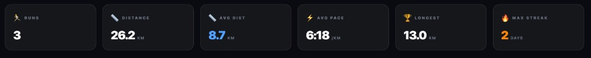
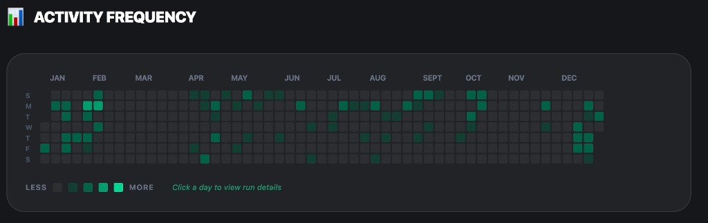
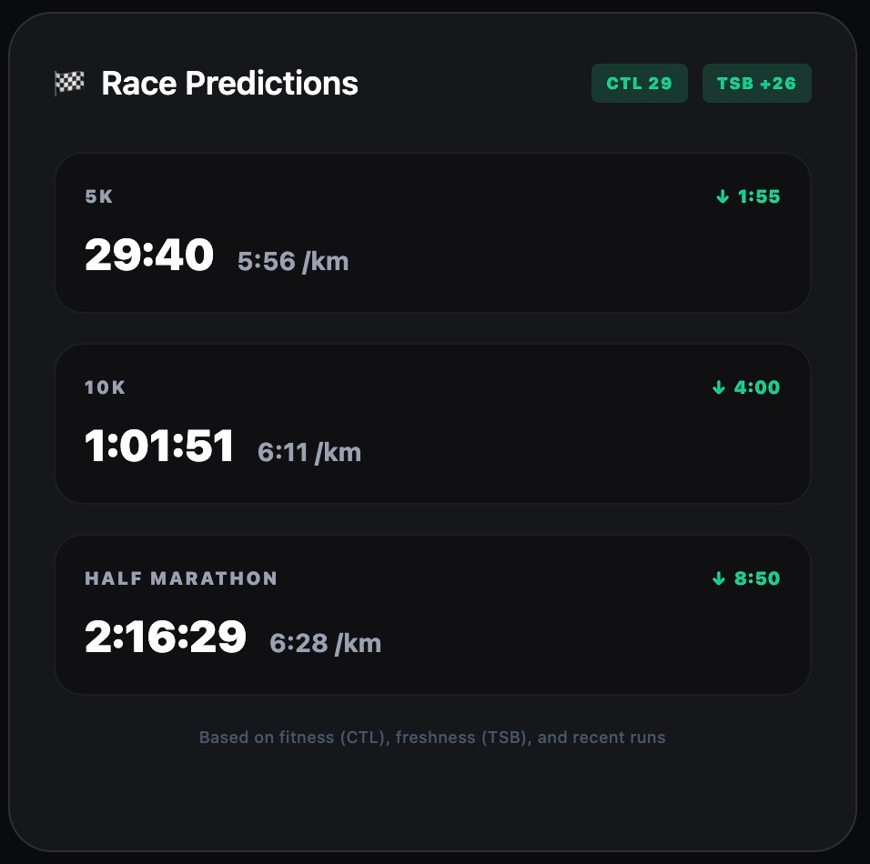
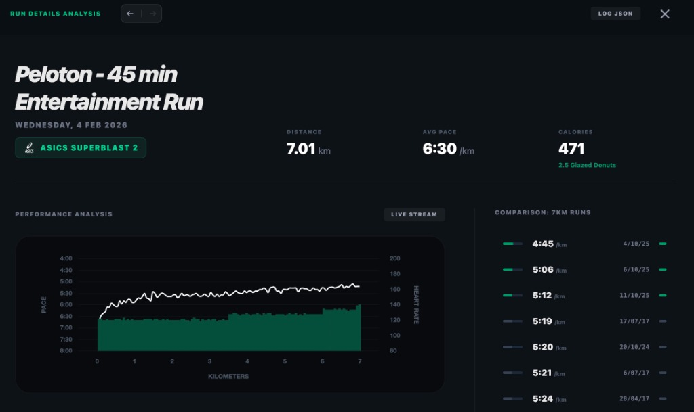
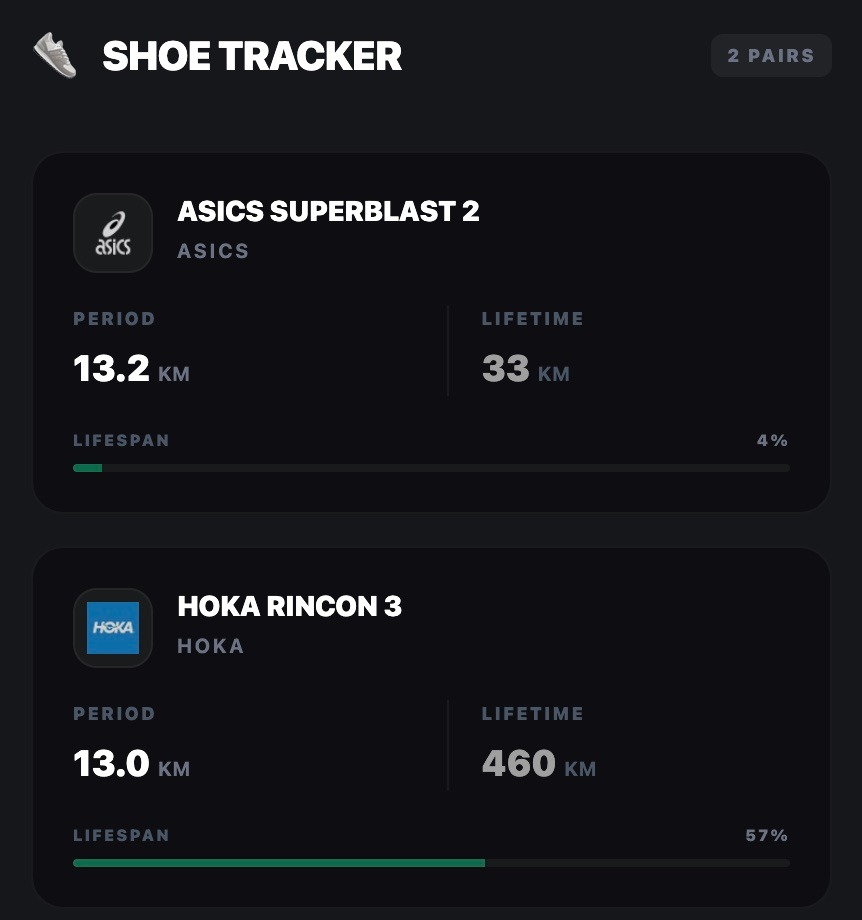
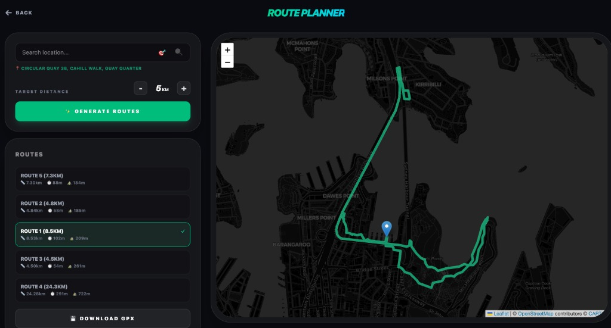

# RunViz 🏃‍♂️

A beautiful, mobile-friendly running stats dashboard that visualizes your Strava data with elite analytics on a Cloudflare stack.



## 📸 Screenshots

| Activity Frequency | Race Predictions |
|:---:|:---:|
|  |  |

| Run Analysis | Shoe Tracker |
|:---:|:---:|
|  |  |

| Route Planner |
|:---:|
|  |

## ✨ Features

- **Advanced Analytics** - GAP, HR zones, and CTL/ATL/TSB tracking
- **AI Route Planner** - Generate personalized round-trip running routes based on distance
- **Intelligent Search** - Geocoding with autocorrect and current location support
- **PR Progress** - Track personal records over time
- **Shoe Tracker** - Monitor mileage on your gear

### Beautiful Visualizations
- 📅 **Calendar Heatmap** - GitHub-style activity visualization
- 📊 **Fitness/Freshness Chart** - Track your training over time
- 🏆 **PR Progress** - Personal record tracking
- 📱 **Mobile-First Design** - Looks great on any device

## 🚀 Quick Start (For Your Own Copy)

### Prerequisites
- Node.js 18+
- Cloudflare account (free tier works!)
- Strava account

### 1. Fork & Clone

```bash
git clone https://github.com/YOUR_USERNAME/runviz.git
cd runviz
```

### 2. Create Auth Providers

1. Create a Google OAuth client for Better Auth sign-in.
2. Create a Resend API key for magic-link delivery.
3. Create a Strava API application for activity data.

For Strava, go to [Strava API Settings](https://www.strava.com/settings/api), create a new application, set **Authorization Callback Domain** to your frontend host, for example `runviz-stats.pages.dev`, and note your **Client ID** and **Client Secret**.

### 3. Deploy Cloudflare Workers Backend

```bash
# Install wrangler CLI
npm install -g wrangler

# Login to Cloudflare
wrangler login

# Navigate to workers directory
cd workers

# Create KV namespace
wrangler kv:namespace create TOKENS
# Copy the id and update wrangler.toml

# Create D1
npx wrangler d1 create runviz-db
# Copy the database_id into workers/wrangler.toml

# Set secrets
wrangler secret put BETTER_AUTH_SECRET
wrangler secret put RESEND_API_KEY
wrangler secret put STRAVA_CLIENT_ID
wrangler secret put STRAVA_CLIENT_SECRET
wrangler secret put ORS_API_KEY
wrangler secret put GOOGLE_CLIENT_ID
wrangler secret put GOOGLE_CLIENT_SECRET
wrangler secret put GOOGLE_REDIRECT_URI

# Update worker vars in wrangler.toml
# FRONTEND_URL=https://your-pages-domain.pages.dev
# FRONTEND_PREVIEW_HOST=your-pages-domain.pages.dev

# Deploy
npm install
npm run deploy
```

### 4. Update Frontend Config

Create `.env` in the root directory:

```env
VITE_API_URL=https://runviz-api.YOUR_SUBDOMAIN.workers.dev
# Optional if serving from a subpath instead of /
# VITE_BASE_PATH=/
```

### 5. Deploy Frontend to Cloudflare Pages

```bash
# Back to root
cd ..

# Install deps and build
npm install
npm run build
```

Then in Cloudflare:

1. Go to Workers & Pages and create or open your Pages project.
2. Connect the GitHub repo.
3. Set the build command to `npm run build`.
4. Set the build output directory to `dist`.
5. Add `VITE_API_URL` as a Pages environment variable if you do not want to rely on `.env.production`.
6. Deploy and visit `https://YOUR_PROJECT.pages.dev`.

Because this app uses React Router, SPA fallback needs to be configured in the deployment target. For the current Cloudflare setup in this repo, that is handled by the root [`wrangler.jsonc`](./wrangler.jsonc) via `assets.not_found_handling = "single-page-application"`.

## 🛠️ Development

```bash
# Frontend
npm install
npm run dev

# Workers (in another terminal)
cd workers
npm install
npm run dev
```

Useful Cloudflare-specific commands:

```bash
# Preview the built frontend in a Pages-like local environment
npm run preview:pages

# Deploy only the Worker from the repo root
npm run deploy:worker

# Use live Cloudflare bindings during Worker development
cd workers && npm run dev:remote
```

## 📁 Project Structure

```
runviz/
├── src/
│   ├── analytics/     # GAP, HR zones, training load
│   ├── components/    # React components
│   ├── hooks/         # Custom hooks
│   ├── services/      # API and caching
│   └── types/         # TypeScript types
├── workers/           # Cloudflare Workers backend
│   └── src/
│       └── index.ts   # OAuth & API proxy
└── .github/
    └── workflows/     # GitHub Actions deployment
```

## ⚙️ Configuration

### Environment Variables

| Variable | Description |
|----------|-------------|
| `VITE_API_URL` | Your Cloudflare Workers URL |
| `VITE_BASE_PATH` | Optional public base path. Leave unset for Cloudflare Pages root deployments |
| `VITE_LOGO_DEV_TOKEN` | Optional Logo.dev publishable token for shoe logos |

### Cloudflare Secrets

| Secret | Description |
|--------|-------------|
| `BETTER_AUTH_SECRET` | Secret used to sign Better Auth sessions and encrypt user-linked secrets |
| `RESEND_API_KEY` | Resend API key for magic-link emails |
| `STRAVA_CLIENT_ID` | From Strava API settings |
| `STRAVA_CLIENT_SECRET` | From Strava API settings |
| `ORS_API_KEY` | From [OpenRouteService](https://openrouteservice.org/dev/#/signup) |
| `GOOGLE_CLIENT_ID` | Optional Google OAuth client for Drive-powered form workflows |
| `GOOGLE_CLIENT_SECRET` | Optional Google OAuth client secret |
| `GOOGLE_REDIRECT_URI` | Redirect URI for the Worker Google callback |

### Cloudflare Worker Vars

| Var | Description |
|-----|-------------|
| `DB` | D1 database binding used by Better Auth |
| `FRONTEND_URL` | Exact production Pages origin allowed for CORS and OAuth fallback redirects |
| `FRONTEND_PREVIEW_HOST` | Preview host suffix for branch deploys, for example `runviz-stats.pages.dev` |
| `ADDITIONAL_FRONTEND_URLS` | Optional comma-separated list of extra allowed frontend origins |

### 🗺️ Map API Setup

The Route Planner uses **OpenRouteService (ORS)** for routing and **Nominatim (OpenStreetMap)** for address search.

1.  **Register**: Sign up for a free account at [OpenRouteService](https://openrouteservice.org/dev/#/signup).
2.  **API Key**: Create a new API Key (Token) in the dashboard.
3.  **Configure**: Add the token to your Cloudflare Worker using `wrangler secret put ORS_API_KEY`.
4.  **Usage**: The free tier allows for 2,000 route requests per day, which is plenty for personal use!

## 📊 Analytics Details

### Grade Adjusted Pace (GAP)
Uses the Minetti formula to calculate metabolic cost at various grades, normalizing hilly runs to flat-ground equivalent.

### Training Load (CTL/ATL/TSB)
- **CTL (Fitness)**: 42-day exponentially weighted average of TRIMP
- **ATL (Fatigue)**: 7-day exponentially weighted average of TRIMP  
- **TSB (Form)**: CTL - ATL, indicates readiness to perform

### Heart Rate Zones
Default 5-zone model based on max HR:
- Zone 1: 50-60% (Recovery)
- Zone 2: 60-70% (Aerobic)
- Zone 3: 70-80% (Tempo)
- Zone 4: 80-90% (Threshold)
- Zone 5: 90-100% (Anaerobic)

## 📝 License

MIT - Fork it, modify it, make it yours!

## 🙏 Acknowledgments

- [Strava API](https://developers.strava.com/) for the data
- [Minetti et al.](https://pubmed.ncbi.nlm.nih.gov/12183501/) for the GAP formula
