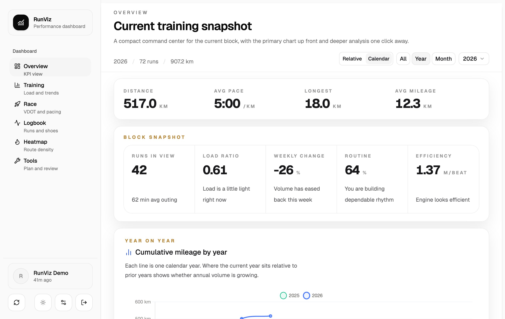
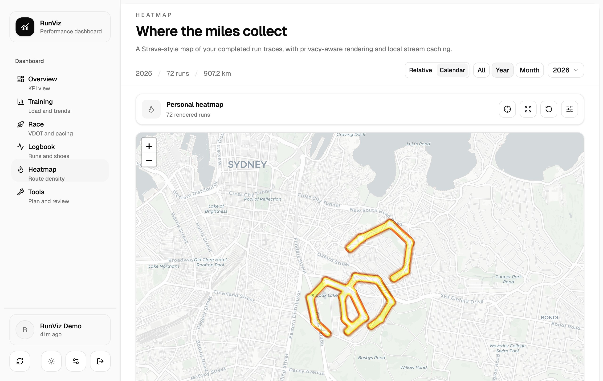
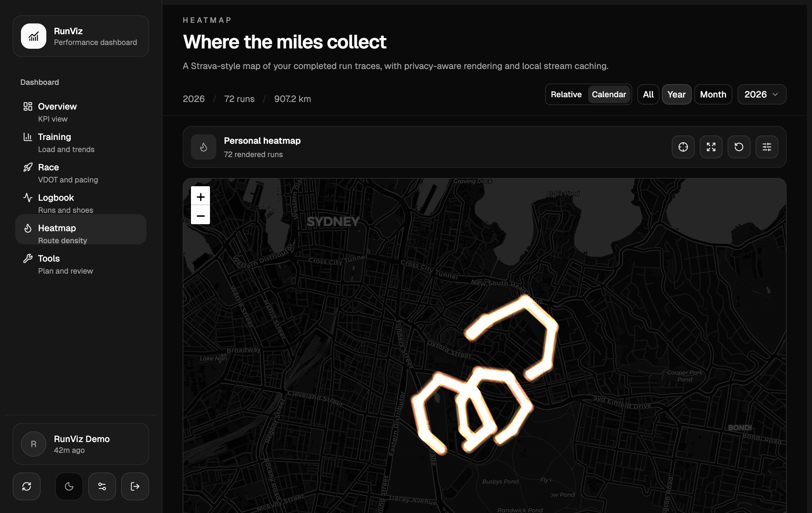
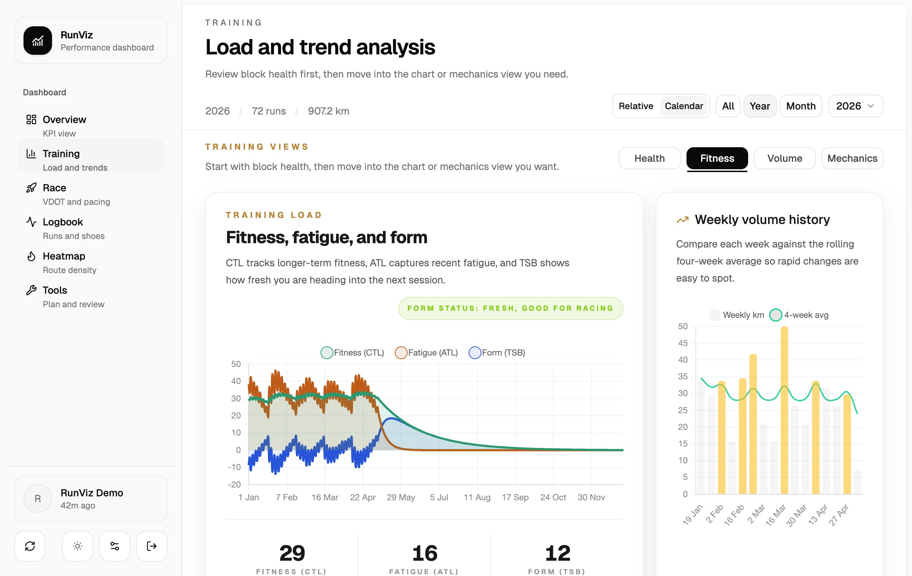
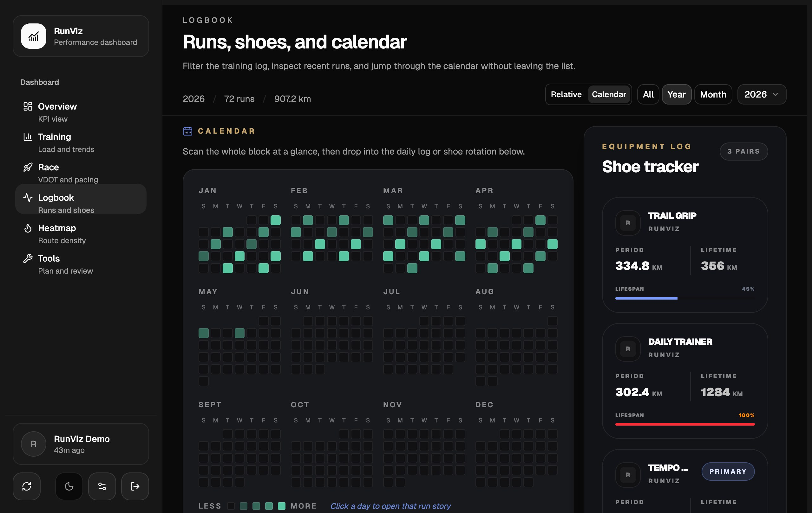

# RunViz 🏃‍♂️

A beautiful, mobile-friendly running stats dashboard that visualizes your Strava data with elite analytics on a Cloudflare stack.



<p align="center"><em>Demo data shown. Screenshots are generated from the current dashboard UI.</em></p>

## 📸 Screenshots

| Personal heatmap | Dark map mode |
|:---:|:---:|
|  |  |

| Training load | Logbook and shoes |
|:---:|:---:|
|  |  |

## ✨ Features

- **Advanced Analytics** - GAP, HR zones, and CTL/ATL/TSB tracking
- **Personal Heatmap** - Strava-like GPS route density map with privacy trimming, shoe filters, all-time or period-scoped views, and light/dark-aware map styling
- **AI Route Planner** - Generate personalized round-trip running routes based on distance
- **Intelligent Search** - Geocoding with autocorrect and current location support
- **PR Progress** - Track personal records over time
- **Shoe Tracker** - Monitor mileage on your gear

### Beautiful Visualizations
- 📅 **Calendar Heatmap** - GitHub-style activity visualization
- 🗺️ **Personal Run Heatmap** - Canvas-rendered GPS route density from Strava activity streams
- 📊 **Fitness/Freshness Chart** - Track your training over time
- 🏆 **PR Progress** - Personal record tracking
- 📱 **Mobile-First Design** - Looks great on any device

### Personal Heatmap

RunViz 5.1 adds a map-first personal heatmap workspace between Logbook and Tools. It uses Strava activity stream GPS data for completed runs, caches streams locally in IndexedDB, and progressively backfills historical GPS traces so repeat visits get faster.

Heatmap controls live in the settings popover:
- **Activities** - Show all activities by default, or respect the current dashboard time filter.
- **Shoes** - Filter the heatmap by the selected pair without cluttering the map header.
- **Colour, opacity, and intensity** - Tune the layer for light or dark mode.
- **Privacy trim** - Hide route points near the start and finish before drawing, without mutating cached GPS data.

## 🚀 Quick Start (For Your Own Copy)

### Prerequisites
- Node.js 18+
- Cloudflare account (free tier works!)
- Strava account

### 1. Fork & Clone

```bash
git clone https://github.com/YOUR_USERNAME/runviz.git
cd runviz
```

### 2. Create Auth Providers

1. Create a Resend API key for magic-link delivery.
2. Create a Strava API application for activity data.
3. Optional: create a Google OAuth client if you want Google sign-in.

For Strava, go to [Strava API Settings](https://www.strava.com/settings/api), create a new application, set **Authorization Callback Domain** to your frontend host, for example `runviz-stats.pages.dev`, and note your **Client ID** and **Client Secret**.

### 3. Configure Cloudflare Resources

RunViz now deploys as a single Cloudflare Worker from the repo root. The React app is built into `dist`, and Cloudflare serves those static assets directly from the Worker using the `assets` block in [`wrangler.jsonc`](./wrangler.jsonc).

```bash
# Install dependencies
npm install

# Create KV namespace
npx wrangler kv:namespace create TOKENS
# Copy the id into wrangler.jsonc

# Create D1
npx wrangler d1 create runviz-db
# Copy the database_id into wrangler.jsonc

# Apply D1 migrations
npx wrangler d1 migrations apply runviz-db --local
npx wrangler d1 migrations apply runviz-db --remote

# Required secrets
npx wrangler secret put BETTER_AUTH_SECRET
npx wrangler secret put RESEND_API_KEY
npx wrangler secret put ORS_API_KEY

# Optional: only if you want Google sign-in or the Google Drive callback flow
npx wrangler secret put GOOGLE_CLIENT_ID
npx wrangler secret put GOOGLE_CLIENT_SECRET
npx wrangler secret put GOOGLE_REDIRECT_URI

# Google Cloud Console
# Add the Better Auth callback URI used by Google sign-in:
#   https://runviz.hwong103.work/api/auth/callback/google
# Keep the existing Drive callback too if you use the Google Drive helper:
#   https://runviz.hwong103.work/auth/google/callback

# Update vars in wrangler.jsonc
# FRONTEND_URL=https://runviz.hwong103.work
# FRONTEND_PREVIEW_HOST=runviz.runviz-stats.workers.dev
```

### 4. Deploy

```bash
npm run deploy
```

### 5. Frontend Config

Create `.env` in the root directory:

```env
# Optional if serving from a subpath instead of /
# VITE_BASE_PATH=/
```

The app and API deploy together through the root [`wrangler.jsonc`](./wrangler.jsonc). The Worker handles `/api/*`, `/api/auth/*`, `/auth/*`, `/setup/strava-key`, and Google callback routes, and Cloudflare serves the React app from `dist` for everything else.

Each signed-in user now saves their own Strava Client ID and Client Secret during setup before connecting Strava. Those credentials are stored per account and are no longer configured as global Worker secrets.

## 🛠️ Development

```bash
npm install
npm run dev

# In another terminal, run the unified Worker with assets
npm run preview:worker
```

Useful Cloudflare-specific commands:

```bash
# Preview the built app with the Worker runtime and static assets
npm run preview:worker

# Deploy the unified Worker and static assets
npm run deploy
```

## ☁️ Cloudflare Configuration

### Runtime shape

- Cloudflare Workers powers both the API and static app delivery.
- The entrypoint is `workers/src/index.ts`.
- [`wrangler.jsonc`](./wrangler.jsonc) points `main` to the Worker and serves `./dist` as static assets.
- SPA routing is enabled with `assets.not_found_handling = "single-page-application"`.
- There is no separate Cloudflare Pages project in the current setup.

### Current bindings

| Binding | Type | Purpose |
|---------|------|---------|
| `ASSETS` | Static asset binding | Serves the built React app from `dist` |
| `DB` | D1 | Better Auth tables plus per-user `strava_keys` storage |
| `TOKENS` | KV | OAuth state, Google session tokens, and legacy token/session storage |

### Worker vars

These are configured in [`wrangler.jsonc`](./wrangler.jsonc):

| Var | Current role |
|-----|--------------|
| `FRONTEND_URL` | Canonical production origin used for redirects, CORS fallback, and trusted origins |
| `FRONTEND_PREVIEW_HOST` | Allows preview/branch hosts that should pass CORS checks |
| `ADDITIONAL_FRONTEND_URLS` | Optional comma-separated allowlist of extra frontend origins |

### Worker secrets

These are read by the Worker at runtime:

| Secret | Required | Purpose |
|--------|----------|---------|
| `BETTER_AUTH_SECRET` | Yes | Signs Better Auth sessions and encrypts saved Strava client secrets |
| `RESEND_API_KEY` | Yes | Sends magic-link emails through Resend |
| `ORS_API_KEY` | Yes | Route generation via OpenRouteService |
| `GOOGLE_CLIENT_ID` | No | Enables Google sign-in and Google callback flow |
| `GOOGLE_CLIENT_SECRET` | No | Enables Google sign-in and Google callback flow |
| `GOOGLE_REDIRECT_URI` | No | Redirect URI for `/auth/google/callback` |

### Database migrations

The Worker expects these D1 tables:

- Better Auth tables from [`workers/migrations/0001_better_auth.sql`](./workers/migrations/0001_better_auth.sql)
- Per-user encrypted Strava app credentials from [`workers/migrations/0002_strava_keys.sql`](./workers/migrations/0002_strava_keys.sql)

Apply them after creating the D1 database:

```bash
npx wrangler d1 migrations apply runviz-db --local
npx wrangler d1 migrations apply runviz-db --remote
```

### Local and production flow

- `npm run dev` runs the Vite frontend locally.
- `npm run preview:worker` builds the app and starts `wrangler dev` against the unified Worker config.
- `npm run deploy` builds the frontend, copies `dist/index.html` to `dist/404.html`, and deploys the Worker plus static assets together.
- Local development origins `http://localhost:5173` and `http://127.0.0.1:5173` are already trusted by the Worker.

## 📁 Project Structure

```
runviz/
├── src/
│   ├── app/           # App-level routing and shell orchestration
│   ├── analytics/     # Shared training calculations
│   ├── components/    # Shared layout and UI primitives only
│   ├── features/      # Feature-owned pages, panels, hooks, and helpers
│   ├── hooks/         # Shared cross-feature hooks
│   ├── services/      # API clients and caches
│   └── types/         # Domain-specific shared types
├── workers/           # Worker source used by the root Cloudflare deploy
│   └── src/
│       ├── domain/    # Insight and memory business logic
│       ├── http/      # CORS, response helpers, routing
│       ├── routes/    # Endpoint handlers
│       ├── services/  # Auth/session and third-party integrations
│       └── index.ts   # Thin Worker bootstrap
├── docs/              # Architecture and module-boundary notes
└── .github/
    ├── workflows/     # GitHub Actions deployment
    └── pull_request_template.md
```

## 🧭 Architecture Notes

- [App architecture](./docs/app-architecture.md)
- [Worker architecture](./docs/worker-architecture.md)
- [Feature module conventions](./docs/feature-module-conventions.md)

## ⚙️ Configuration

### Environment Variables

| Variable | Description |
|----------|-------------|
| `VITE_API_URL` | Optional override for the API origin. Leave unset for the unified same-origin Worker setup |
| `VITE_BASE_PATH` | Optional public base path |
| `VITE_LOGO_DEV_TOKEN` | Optional Logo.dev publishable token for shoe logos |

### Cloudflare Secrets

| Secret | Description |
|--------|-------------|
| `BETTER_AUTH_SECRET` | Secret used to sign Better Auth sessions and encrypt user-linked secrets |
| `RESEND_API_KEY` | Resend API key for magic-link emails |
| `ORS_API_KEY` | From [OpenRouteService](https://openrouteservice.org/dev/#/signup) |
| `GOOGLE_CLIENT_ID` | Optional Google OAuth client for Drive-powered form workflows |
| `GOOGLE_CLIENT_SECRET` | Optional Google OAuth client secret |
| `GOOGLE_REDIRECT_URI` | Redirect URI for the Worker Google callback (`/auth/google/callback`) |

### Cloudflare Worker Vars

| Var | Description |
|-----|-------------|
| `FRONTEND_URL` | Exact production app origin allowed for CORS and OAuth fallback redirects |
| `FRONTEND_PREVIEW_HOST` | Preview host suffix for branch deploys, for example `runviz.runviz-stats.workers.dev` |
| `ADDITIONAL_FRONTEND_URLS` | Optional comma-separated list of extra allowed frontend origins |

### 🗺️ Map API Setup

The Route Planner uses **OpenRouteService (ORS)** for routing and **Nominatim (OpenStreetMap)** for address search.

1.  **Register**: Sign up for a free account at [OpenRouteService](https://openrouteservice.org/dev/#/signup).
2.  **API Key**: Create a new API Key (Token) in the dashboard.
3.  **Configure**: Add the token to your Cloudflare Worker using `wrangler secret put ORS_API_KEY`.
4.  **Usage**: The free tier allows for 2,000 route requests per day, which is plenty for personal use!

## 📊 Analytics Details

### Grade Adjusted Pace (GAP)
Uses the Minetti formula to calculate metabolic cost at various grades, normalizing hilly runs to flat-ground equivalent.

### Training Load (CTL/ATL/TSB)
- **CTL (Fitness)**: 42-day exponentially weighted average of TRIMP
- **ATL (Fatigue)**: 7-day exponentially weighted average of TRIMP  
- **TSB (Form)**: CTL - ATL, indicates readiness to perform

### Heart Rate Zones
Default 5-zone model based on max HR:
- Zone 1: 50-60% (Recovery)
- Zone 2: 60-70% (Aerobic)
- Zone 3: 70-80% (Tempo)
- Zone 4: 80-90% (Threshold)
- Zone 5: 90-100% (Anaerobic)

## 📝 License

MIT - Fork it, modify it, make it yours!

## 🙏 Acknowledgments

- [Strava API](https://developers.strava.com/) for the data
- [Minetti et al.](https://pubmed.ncbi.nlm.nih.gov/12183501/) for the GAP formula
